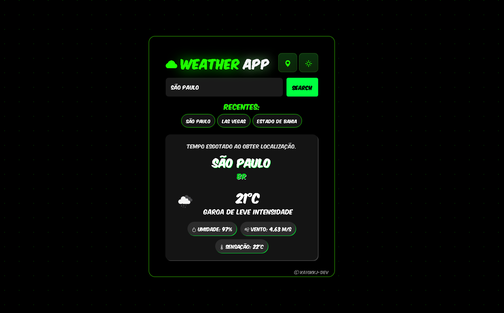

# 🌤️ Weather App

A modern weather application built with **HTML, CSS, and JavaScript** using the **OpenWeather API**.

This project allows users to search for weather conditions in any city worldwide and also supports geolocation to display the weather based on the user's current location.

---

## 🚀 Features

- 🌎 Search weather by city name
- 📍 Get weather using your current location
- 🌙 Dark / Light mode toggle
- 🕘 Recent searches saved with LocalStorage
- 📱 Responsive design
- 🌡️ Temperature, humidity, wind speed and feels-like temperature
- 🎨 Modern UI with custom styling

---

## 🛠️ Technologies Used

- HTML5
- CSS3
- JavaScript (Vanilla JS)
- OpenWeather API
- Bootstrap Icons

---

## 📸 Preview



---

## ⚙️ How to Run the Project

1. Clone the repository

```bash
git clone https://github.com/SEU-USUARIO/WeatherApp.git
